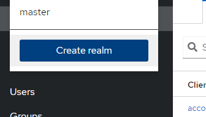
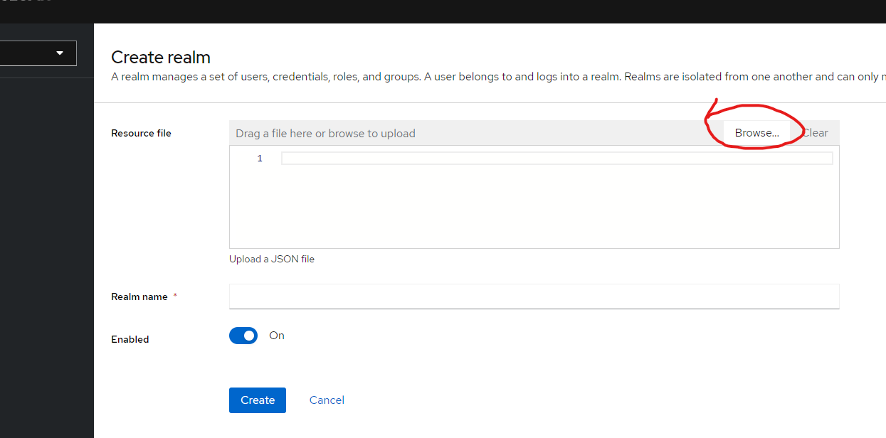
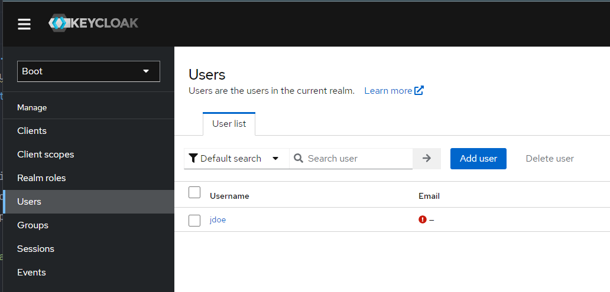

# Authentication with Spring Boot and Keycloak

## About

This project was implemented using the following technologies

- [Kotlin 1.9.22](https://kotlinlang.org/docs/home.html)
- [Spring Boot 3.2.2](https://spring.io/projects/spring-boot)
- Java version Temurin 21
- [Keycloak (latest)](https://www.keycloak.org/server/containers)

## Structure

The project is split in two folders
- docker: docker-compose configurations to run postgres and the keycloak image
- authenticator: spring boot application

### Running keycloak
- start docker 
- inside the `docker` folder, run ``docker compose up -d``

This will start an instance of keycloak accessible at http://localhost:9000. Check the `docker-compose.yml` file to connect to postgres
After logging in with the credentials set in the docker-compose file:
- access the menu

- select the option `browse`

- upload the json file inside ``docker/keycloak-data/Boot-realm.json``
- add a new user, with a username of your preference

- go to `credentials` and set a password

### Running the application
To run the application, you need to:

1. open the project in intellij or another editor and run the task `bootRun`
OR
2. run `gradle bootRun` inside of `authentication` folder
